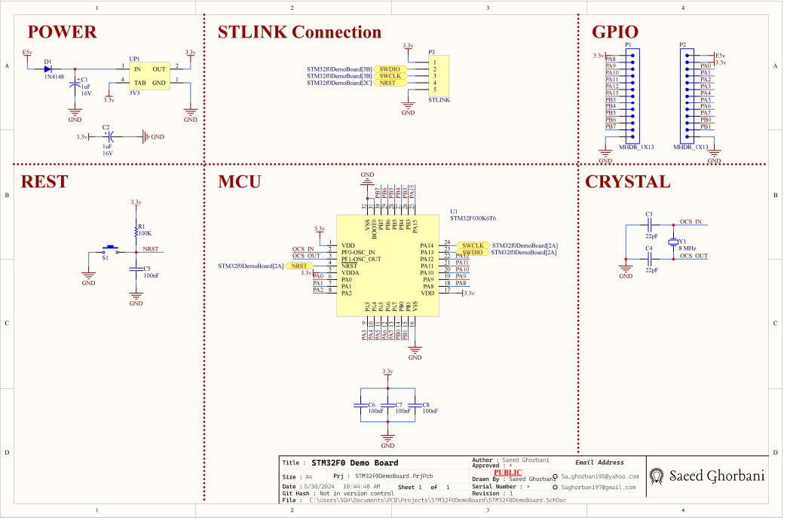
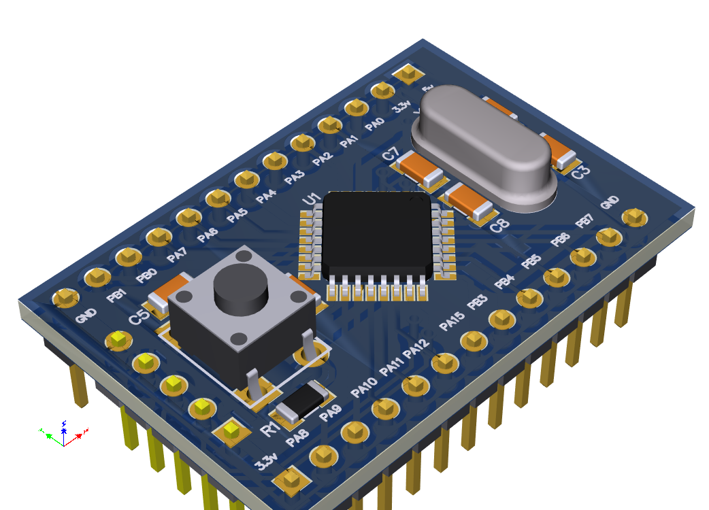
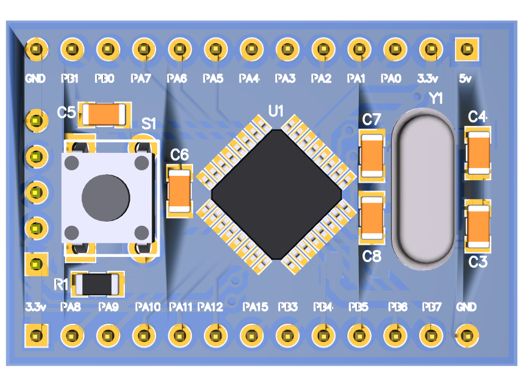
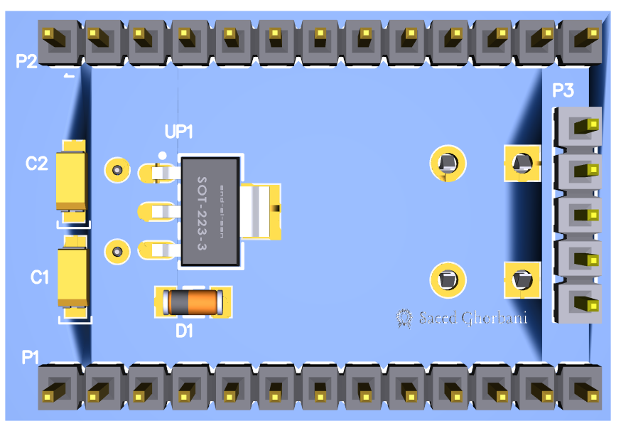

# Microcontroller Development Board - برد توسعه میکروکنترلر STM32F030K6T6

## Introduction - مقدمه

This repository contains the design files for a development board based on the STM32F030K6T6 microcontroller. The project is created in Altium Designer software.
این مخزن حاوی فایل‌های طراحی برای یک برد توسعه بر پایه میکروکنترلر STM32F030K6T6 است. این پروژه با استفاده از نرم‌افزار Altium Designer ایجاد شده است.

## Features - ویژگی‌ها

| Feature                 | ویژگی                    |
|-------------------------|--------------------------|
| STM32F030K6T6 Microcontroller | میکروکنترلر STM32F030K6T6 |
| GPIO Headers            | هدرهای GPIO             |
| Power Supply Circuitry  | مدار تامین توان         |

## Repository Structure - ساختار مخزن

- **/Documentation - /مستندات**: Contains documentation files - حاوی فایل‌های مستندات است.
- **/Design Files - /فایل‌های طراحی**: Contains Altium Designer project files - حاوی فایل‌های پروژه Altium Designer است.
- **/Images - /تصاویر**: Contains images related to the project - حاوی تصاویر مربوط به پروژه است.

## Getting Started - شروع کار

To get started with this project, follow these steps:
برای شروع کار با این پروژه، مراحل زیر را دنبال کنید:

1. Clone this repository to your local machine.
این مخزن را به ماشین محلی خود کلون کنید.
2. Open the Altium Designer project file located in the `Design Files` directory.
فایل پروژه Altium Designer را که در دایرکتوری `فایل‌های طراحی` قرار دارد باز کنید.
3. Review the schematic and PCB layout.
شماتیک و طرح PCB را بررسی کنید.
4. Assemble the components onto the PCB.
قطعات را روی PCB مونتاژ کنید.
5. Connect the board to your computer and program it using an appropriate IDE.
برد را به کامپیوتر خود متصل کنید و با استفاده از یک محیط توسعه مناسب برنامه‌ریزی کنید.

## Board Specifications - مشخصات برد

- **Microcontroller - میکروکنترلر**: STM32F030K6T6
- **Dimensions - ابعاد**: 36.20mm  x  24.50mm
- **Power Input - ورودی توان**: 5 volt
  
## Contribution - مشارکت

Contributions to this project are welcome.
مشارکت‌ها در این پروژه مورد استقبال قرار می‌گیرد.

To contribute, please follow these steps:
برای مشارکت، لطفاً مراحل زیر را دنبال کنید:

1. Fork this repository.
این مخزن را فورک کنید.
2. Create a new branch (`git checkout -b feature/new-feature`).
یک شاخه جدید بسازید (`git checkout -b feature/new-feature`).
3. Make your changes.
تغییرات خود را اعمال کنید.
4. Commit your changes (`git commit -am 'Add new feature'`).
تغییرات خود را ثبت کنید (`git commit -am 'افزودن ویژگی جدید'`).
5. Push to the branch (`git push origin feature/new-feature`).
به شاخه خود را پوش کنید (`git push origin feature/new-feature`).
6. Create a new Pull Request.
یک درخواست Pull جدید ایجاد کنید.

## License - لایسنس

This project is licensed under the MIT License.
این پروژه تحت [مجوز MIT](LICENSE) منتشر شده است.

## Contact - تماس

For any inquiries or support regarding this project, please contact:
برای هرگونه سوال یا پشتیب

### *sa_ghorbani95@yahoo.com*